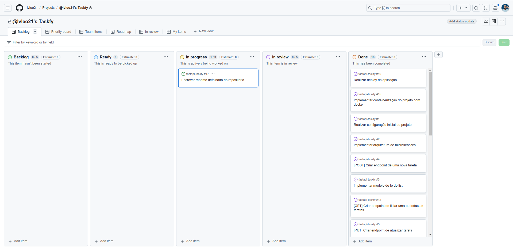

<h1 align="center">
  <a href="https://fastapi-taskfy.fly.dev/">Taskfy</a>
</h1>


<p align="center">
  Taskfy é a solução perfeita para quem busca organizar tarefas e aumentar a produtividade de forma prática e eficiente. A API foi desenvolvida utilizando
  FastAPI em conjunto com Docker, PostgreSQL, Redis e está hospedada no Fly.io.
  Para acessar a aplicação basta acessar o link <a href="https://fastapi-taskfy.fly.dev/">clicando aqui</a>.
</p>

## Como o projeto foi organizado e executado?

<p>
  O projeto foi estruturado com base em um desáfio técnico e tinha como objetivo
  avaliar as habilidades de desenvolvimento em backend com Python, utilizando o framework FastAPI. Para isso, é necessário a implementação de um microserviço para gerenciar uma lista de tarefas (to-do list), com as operações CRUD (Create, Read, Update, Delete) e alguns requisitos adicionais.
</p>

### Requisitos
- [X] CRUD das tarefas
- [X] Persistência de dados com PostgreSQL
- [X] Otimização de consultas
- [X] Implementação de estrutura no padrão de microserviço
- [X] Implementação de testes unitários para as funcionalidades
- [X] Implementação de testes de integração
- [X] Implementação de cache de resultados com Redis
- [X] Utilizar Docker para containerizar o projeto
- [ ] Configurar o projeto para rodar em um ambiente Kubernetes
- [X] Realizar o deploy do microserviço em alguma infraestrutura

### Github Projects



<p>
  A partir dos requisitos, utilizei o *Github Projects* para gerenciar as tarefas do
  projeto. Este projeto, seguiu a metodologia do kanban e incialmente as tarefas foram
  inseridas no backlogo. Após a finalização do planejamento e estratégia de desenvolimento,
  as tarefas foram alteradas para ready. Com decorrer dos dias, as tarefas foram sendo alteradas
  de status a medida que eram executada (in progress, in review e por fim done).
</p>

## Quais foram as tecnologias utilizadas?

- **FastAPI:** Um framework web rápido para construir APIs em Python, focado em alto desempenho e simplicidade.
- **Redis:** Um banco de dados em memória, rápido e escalável, usado para cache, filas e armazenamento de dados.
- **Docker:** Plataforma para criar, implantar e gerenciar contêineres, permitindo isolamento e portabilidade de aplicações.
- **Alembic:** Uma ferramenta de migração de banco de dados usada com SQLAlchemy, que facilita o versionamento de esquemas.
- **SQLAlchemy:** Um ORM (Object Relational Mapper) para Python que facilita a interação com bancos de dados relacionais.
- **PostgreSQL:** Um banco de dados relacional open-source, conhecido por sua robustez, extensibilidade e suporte a operações complexas e dados estruturados.
- **Fly.io:** Uma plataforma de hospedagem de aplicativos que permite o deploy em servidores globais próximos aos usuários.

## Como rodar o projeto localmente?

### Com Docker

#### Pré-requisito

- Docker / Docker compose
- Github

#### Passos
<p>Para rodar o projeto com docker siga as seguintes passos:</p>

1 - Clonar o repositório
```bash
git clone git@github.com:lvleo21/fastapi-taskfy.git
```

2 - Abrir o repositório clonado em sua IDE de preferência
```bash
code fastapi-taskfy/ # 'code' para vscode
```

3 - No terminal da IDE (ou em algum de sua preferência e acessando a pasta do repositório) rodar comando do makefile para buildar o projeto


```bash
# Com Makefile
make up-taskfy

# Sem Makefile
docker compose -f docker-compose.yml up -d --build --force-recreate --remove-orphans
```

4 - Em seu navegador acessar o `localhost`
```bash
http://localhost:8000/
```

### Sem Docker

#### Pré-requisito

- Github
- Python 3.9+
- Pip
- PostgreSQL
- Redis
- Virtualenv (venv)

#### Passos
<p>Para rodar o projeto com docker siga as seguintes passos:</p>

1 - Clonar o repositório
```bash
git clone git@github.com:lvleo21/fastapi-taskfy.git
```

2 - Abrir o repositório clonado em sua IDE de preferência
```bash
code fastapi-taskfy/ # 'code' para vscode
```

3 - No terminal da IDE (ou em algum de sua preferência e acessando a pasta do repositório) rodar comando para criar e ativar o ambiente virtual 

"***venv** é uma ferramenta do Python para criar ambientes virtuais, permitindo isolar dependências e pacotes específicos para projetos diferentes. Um ambiente virtual ajuda a evitar conflitos entre bibliotecas e facilita a gestão das versões dos pacotes usados no projeto.*"

```bash
python3 -m venv venv
source venv/bin/activate
```

4 - Agora é necessário instalar todas as dependências do projeto que estão registradas
no arquivo de `requirements.txt`

```bash
pip install --upgrade pip
pip install -r requirements.txt --no-cache-dir
```

**Atenção:** antes de seguir para os próximos passos certifique-se que seu `postgres` e `redis` estejam rodando corretamente.

5 - Faça uma cópia do arquivo `.env-example` e renomei para `.env`

6 - Ainda em `.env` preencha o `DATABASE_URL` com as informações correspondentes

```text
DATABASE_URL=postgresql://<SEU_USUARIO>:<SUA_SENHA>@<SEU_HOST>:<SUA_PORTA>/<SEU_DATABASE>
```

7 - Para executar aplicação **Com Makefile**:

```bash
# Rodar as migrações
make migrate-taskfy

# Executar aplicação
make start-taskfy
```

8 - Para executar aplicação **Sem Makefile**:

```bash
# Executa as migrações do banco de dados
alembic upgrade head

# Inicia a aplicação
uvicorn --host localhost --port 8000 main:app --reload
```

9 - Aplicação estará disponível em `localhost:8000`
```bash
http://localhost:8000/
```

**Extra:** Para rodar os testes execute **pytest**
```bash
pytest
```

